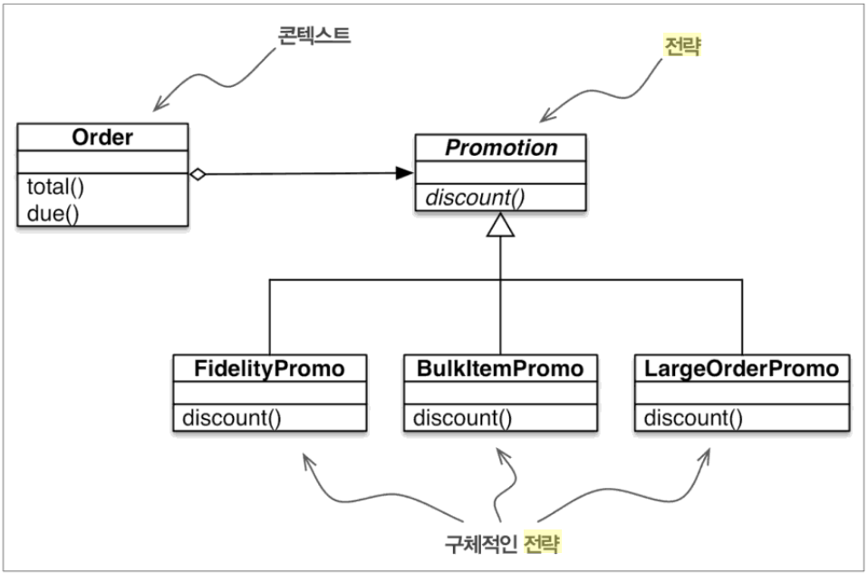
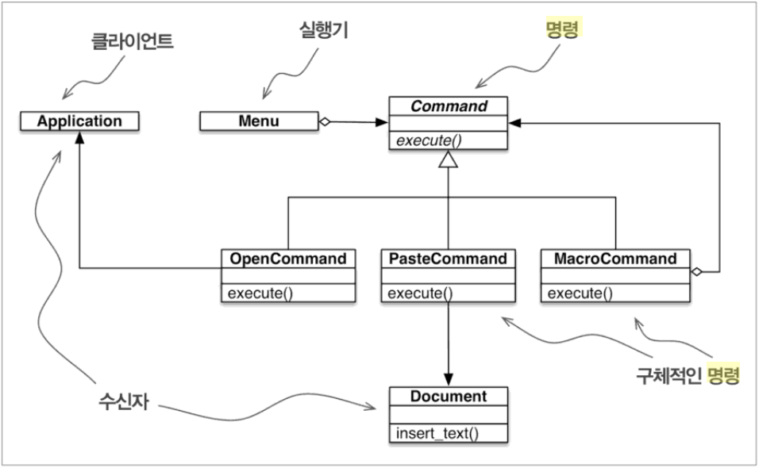

# 일급 함수 디자인 패턴

디자인 패턴이 언어에 독립적이긴 하지만, 그렇다고 해서 모든 언어에 적용될 수 있는 것은 아닙니다. 

패턴에 참여하는 일부 클래스의 객체를 간단한 함수로 교체하면, 획일적으로 반복되는 코드의 상당 부분을 줄일 수 있을 것 입니다. 

이 장에서는 함수 객체를 이용해서 전략 패턴을 리팩토링하고, 비슷한 방버으로 명령 패턴을 단순화하는 방법을 설명합니다.


## 6.1 사례: 전략 패턴의 리팩토링

전략 패턴은 파이썬에서 함수를 일급 객체로 사용하면 더욱 간단해질 수 있는 디자인 패턴의 대표적인 사례입니다.


### 6.1.1 고전적인 전략



위 그림의 전략 패턴에 대한 UML 클래스 다이어그램에 들어가는 구성 요소는 다음과 같습니다.

* 콘텍스트

  일부 계산을 서로 다른 알고리즘을 구현하는 교환 가능한 컴포넌트에 위임함으로써 서비스를 제공합니다. 전자상거래 예제에서 콘텍스트는 Order로서, 여러 알고리즘 중 하나에 따라 프로모션 할인을 적용하도록 설정됩니다.

* 전략

  여러 알고리즘을 구현하는 컴포넌트에 공통된 인터페이스로서 전자상거래 예제에서는 이 역할을 Promotion이라는 추상 클래스가 담당합니다.

* 구체적인 전략

  전략의 구상 서브클래스 중 하나로서 여기서는 FidelityPromo, BulkItemPromo, LargeOrderPromo 등 총 3개의 구체적인 전략이 구현되어 있습니다.

디자인 패턴에서는 전략 패턴을 다음과 같이 설명합니다.

``` 
일련의 알고리즘을 정의하고 각각을 하나의 클래스 안에 넣어서 교체하기 쉽게 만든다. 전략을 이용하면 사용하는 클라이언트에 따라 알고리즘을 독립적으로 변경할 수 있다.
```


전략 패턴의 예는 고객의 속성이나 주문한 상품에 따라 할인을 계산하는 전자상거래 영역에서 쉽게 볼 수 있습니다.

온라인 상점이 다음과 같은 할인 규칙을 가지고 있다고 가정합시다.

* 충성도 포인트가 1000점 이상인 고객은 전체 주문에 대해 5% 할인을 적용한다.
* 하나의 주문에서 20개 이상의 동일 상품을 구입하면 해당 상품에 대해 10% 할인을 적용한다.
* 서로 다른 상품을 10종류 이상 주문하면 전체 주문에 대해 7% 할인을 적용한다.
* 이 때 하나의 주문에는 하나의 할인 규칙만 적용된다.

이를 코드로 나타내면 다음과 같습니다.

``` python
from abc import ABC, abstractmethod
from collections import namedtuple

Customer = namedtuple('Customer', 'name fidelity')


class LineItem:
    def __init__(self, product, quantity, price):
        self.product = product
        self.quantity = quantity
        self.price = price

    def total(self):
        return self.price * self.quantity


class Order:  # 콘텍스트
    def __init__(self, customer, cart, promotion=None):
        self.customer = customer
        self.cart = list(cart)
        self.promotion = promotion

    def total(self):
        if not hasattr(self, '__total'):
            # __을 통해 private 변수 지정
            self.__total = sum(item.total() for item in self.cart)
        return self.__total

    def due(self):
        if self.promotion is None:
            discount = 0
        else:
            discount = self.promotion.discount(self)
        return self.total() - discount

    def __repr(self):
        fmt = '<Order total: {:.2f} due: {:/2f}>'
        return fmt.format(self.total(), self.due())


class Promotion(ABC):
    @abstractmethod
    def discount(self, order):
        """ 할인액을 구체적인 숫자로 반환한다. """


class fidelityPromo(Promotion):
    def discount(self, order):
        """ 충성도 포인트가 1000점 이상인 고객은 전체 주문에 대해 5% 할인을 적용한다. """
        return order.total() * .05 if order.customer.fidelity >= 1000 else 0


class BulkItemPromo(Promotion):
    def discount(self, order):
        """ 하나의 주문에서 20개 이상의 동일 상품을 구입하면 해당 상품에 대해 10% 할인을 적용한다. """
        discount = 0
        for item in order.cart:
            if item.quantity >= 20:
                discount += item.total() * .1
            return discount


class LargeOrderPromo(Promition):
    def discount(self, order):
        """ 서로 다른 상품을 10종류 이상 주문하면 전체 주문에 대해 7% 할인을 적용한다. """
        distinct_items = {item.product for item in order.cart}
        if len(distinct_items) >= 10:
            return order.total() * .07
        return 0

```


이를 테스트하면 다음과 같이 잘 동작합니다.

``` python
joe = Customer('John Doe', 0)
ann = Customer('Ann Smith', 1100)

cart = [
    LineItem('banana', 4, .5),
    LineItem('apple', 10, 1.5),
    LineItem('watermellon', 5, 5.0)
]

joe_order = Order(joe, cart, fidelityPromo())
ann_order = Order(ann, cart, fidelityPromo())

print(joe_order)
# <Order total: 42.00 due: 42.00>
print(ann_order)
# <Order total: 42.00 due: 39.90>
```


다음 코드도 제대로 동작하지만 파이썬에서 함수를 객체로 사용하면 더 적은 코드로 동일한 기능을 구현할 수 있습니다.


### 6.1.2 함수지향 전략

위에서는 각각의 클래스에서 discount() 라는 메서드 재정의하면서 문제를 해결하였습니다.

하지만 각 클래스는 객체 속성도 가지고 있지 않습니다.

따라서 이를 함수로 변경하여 리팩토링 해봅시다.

```python
from abc import ABC, abstractmethod
from collections import namedtuple

Customer = namedtuple('Customer', 'name fidelity')


class LineItem:
    def __init__(self, product, quantity, price):
        self.product = product
        self.quantity = quantity
        self.price = price

    def total(self):
        return self.price * self.quantity


class Order:  # 콘텍스트
    def __init__(self, customer, cart, promotion=None):
        self.customer = customer
        self.cart = list(cart)
        self.promotion = promotion

    def total(self):
        if not hasattr(self, '__total'):
            self.__total = sum(item.total() for item in self.cart)
        return self.__total

    def due(self):
        if self.promotion is None:
            discount = 0
        else:
            discount = self.promotion(self)
        return self.total() - discount

    def __repr__(self):
        fmt = '<Order total: {:.2f} due: {:.2f}>'
        return fmt.format(self.total(), self.due())


def fidelity_promo(order):
    return order.total() * .05 if order.customer.fidelity >= 1000 else 0


def bulk_item_promo(order):
    discount = 0
    for item in order.cart:
        if item.quantity >= 20:
            discount += item.total() * .1
        return discount


def large_order_promo(order):
    distinct_items = {item.product for item in order.cart}
    if len(distinct_items) >= 10:
        return order.total() * .07
    return 0
```


결과는 위와 동일합니다.

``` python
joe = Customer('John Doe', 0)
ann = Customer('Ann Smith', 1100)

cart = [
    LineItem('banana', 4, .5),
    LineItem('apple', 10, 1.5),
    LineItem('watermellon', 5, 5.0)
]

joe_order = Order(joe, cart, fidelity_promo)
ann_order = Order(ann, cart, fidelity_promo)

print(joe_order)
# <Order total: 42.00 due: 42.00>
print(ann_order)
# <Order total: 42.00 due: 39.90>
```


`디자인 패턴`의 저자는 **전략 객체는 종종 훌륭한 플라이웨이트가 되기도 한다** 는 흥미로운 설명을 하며 플라이웨이트는 여러 콘텍스트에서 동시에 사용할 수 있는 공유 객체라고 정의하였습니다. 새로운 콘텍스트에서 동일 전략 객체를 반복해서 적용할 때는 새로 생성하는 비용을 줄이기 위해 플라이웨이트를 공유하는 것이 좋습니다. 

위 예제에서도 Order 객체를 만들 때 기존 전략 객체가 있으면 재사용할 수 있고 이를 통해 런타임 비용을 줄일 수 있습니다. 하지만 소스코드의 행 수와 유지보수 비용은 눈덩이처럼 불어납니다.

위에서 전략 패턴을 함수로 구현했으므로, 또 다른 문제가 생길 수 있습니다. 예를 들면 주어진 Order 객체에 대해 적용할 수 있는 가장 좋은 할인 전략을 선택하는 메타 전략을 만든다고 가정합시다.


### 6.1.3 최선의 전략 선택하기: 단순한 접근법

다음과 같이 단순하게 최선의 전략을 찾아줄 수 있습니다. 하지만 이 경우 새로운 할인 전략이 생긴다면 promos 리스트에 추가 해줘야 하는 번거로움이 생깁니다.

``` python
promos = [fidelity_promo, bulk_item_promo, large_order_promo]


def best_promo(order):
    """ 최대로 할인받을 금액을 반환한다. """
    return max(promo(order) for promo in promos)

```


### 6.1.4 모듈에서 전략 찾기

파이썬 모듈도 일급 객체로서, 모듈을 다루는 여러 함수가 표준 라이브러리에서 제공됩니다. 

파이썬 문서에서는 globals() 내장 함수를 다음과 같이 설명하고 있습니다.

``` 
현재 전역 심벌 테이블을 나타내는 딕셔너리 객체를 반환한다. 이 딕셔너리는 언제나 현재 모듈에 대한 내용을 담고 있다. (함수나 메서드 안에서 호출할 때, 함수를 호출한 모듈이 아니라 함수가 정의된 모듈을 나타낸다.)
```


아래 예제는 globals()에 꼼수를 부려 best_promo()가 자동으로 다른 *_promo() 함수들을 찾아내게 합니다.

``` python
promos = [globals()[name] for name in globals()
          if name.endswith('_promo')
          and name != 'best_promo']
```


다음 예제는 promotion 관련 함수들을 promotions.py에 따로 저장하고 해당 파일을 읽어 조작해줍니다.

getmembers를 통해서 뒤에 조건식에 해당하는 객체만 불러오고 여기서는 함수만 불러옵니다.

```python
import inspect
import promotions

promos = [func for name, func in inspect.getmembers(
    promotions, inspect.isfunction)]
```

하지만 이 같은 경우 promotions.py 에 다른 함수가 들어오게 된다면 오류가 발생합니다.


## 6.2 명령

함수를 인수로 전달하는 기법을 사용하면 명령 디자인 패턴도 구현을 단순하게 할 수 있습니다.

아래 그림은 명령 디자인 패턴으로 구현한 메뉴 방식  텍스트 편집기에 대한 UML 클래스 다이어그램입니다.




명령 패턴의 목적은 연산을 실행하는 객체(호출자)와 연산을 구현하는 객체(수신자)를 분리하는 것입니다.

기본 개념은 명령 객체를 수신자와 호출자 사이에 놓고 명령은 execute()라는 단 하나의 메서드로 인터페이스를 구현합니다. execute()는 원하는 연산을 수행하기 위해 수신자가 가지고 있는 메서드를 호출합니다. 

이런 방식을 사용하면 호출자는 수신자의 인터페이스를 알 필요가 없으며 명령의 서브클래스를 통해 서로 다른 수신자를 추가할 수 있습니다. 호출자는 구체적인 명령으로 설정되며 연산을 실행하기 위해 execute() 메서드를 호출합니다. 


`디자인 패턴`에서는 **명령은 콜백에 대한 객체지향식 대체물**이라고 설명하고 있습니다. 그렇지만 콜백을 객체지향식 대체물로 바꿀 필요가 있을까요?

호출자에 Command 객체 대신 간단히 함수를 바로 지정할 수 있습니다. command.execute()를 호출하는 대신, 호출자는 단지 command()를 호출하면 됩니다. 

```python
class MarcoCommand():
    """ 명령 리스트를 실행하는 명령 """
    def __init__(self, commands):
        self.commands = list(commands)

    def __call__(self):
        for command in self.commands:
            command()
```


실행 취소 지원 등 고급 기능의 명령 패턴을 구현하려면 단순한 콜백 함수로는 어려울 수도 있지만, 이런 경우에도 파이썬에서는 다음과 같은 두 가지 대안을 제시합니다.

* MacroCommand와 같은 콜러블 객체는 필요한 상태를 보관함으로써 `__call__() ` 메서드 이외의 메서드도 제공할 수 있습니다.
* 함수가 호출된 후의 상태를 내부에 보관하기 위해 클로저를 사용할 수 있습니다.

